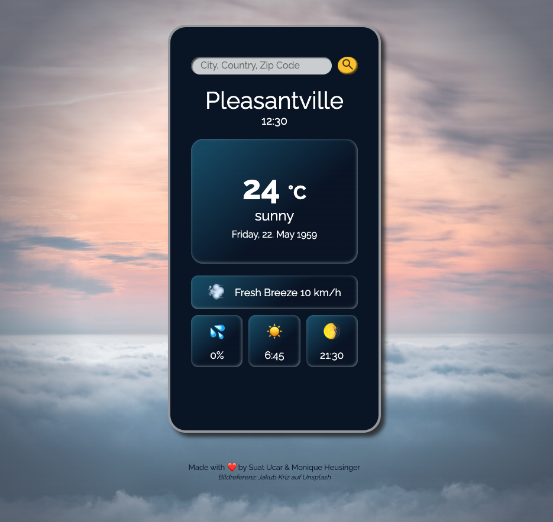

# The Weather App ☀️🌧️

The Weather App displays the current weather for a city chosen by the user.

The landing page shows the fictional weather data of the heavenly city of Pleasantville.

To view the weather in another city, you can use the top search bar (enter the city or country or zip code for a result).

The App uses a weather API (Open Weather API - https://openweathermap.org/).

---

This project was created as part of a coding bootcamp (fullstack development) at SuperCode GmbH.

## Have a look: 👀

💻 https://moniqueheusinger.github.io/Weather_App/

## Authors 🧑‍💻👩‍💻

[@SuperCoderSuat (Suat Ucar)](https://github.com/SuperCoderSuat),  
[@MoniqueHeusinger](https://github.com/MoniqueHeusinger)

## Screenshot 📸

 

## Tech Stack

HTML5, CSS3, Java Script

## To do 🚧🛠️

- Add a weather icon for each weather condition
- Add a forecast (5 days)

## Presentation 📊📽️

[Presentation Project The Weather App](./misc/weather_app_presentation.mp4)
